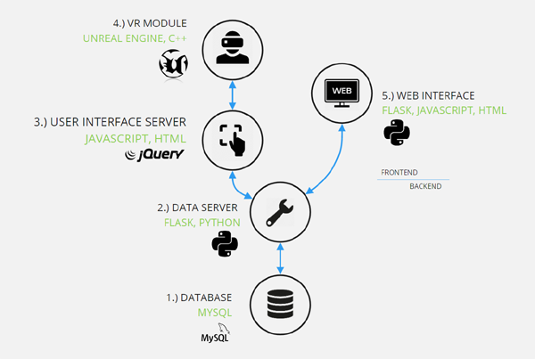

## **DataDiVR - A Virtual Reality Framework for Network Visualization and Analytics**


Performant visualization is key to discovering context in large graphs.

## **Content**

[**Hardware Requirements**](#Hardware-Requirements)

[**Installation: Quick Start**](#Installation-Quick-Start)

[**Installation: Stand Alone**](#Installation-Stand-Alone)

[**DataDiVR Architecture Overview**](#DataDiVR-Architecture-Overview)

[**Tutorial 1: Using the Uploader to add your own network**](#Tutorial-1-Using-the-Uploader-to-add-your-own-network)

[**Tutorial 2: Creating custom User Interfaces**](#Tutorial-2-Creating-custom-User-Interfaces)

[**Tutorial 3: Creating a route on the backend**](#Tutorial-3-Creating-a-route-on-the-backend)

[**VRnet API Documentation**](#VRnet-API-Documentation)


## **Hardware Requirements**

 We are running the platform on an MSI gaming laptop with the following specs:
 - CPU: i7 - 7820HK
 - RAM: 16 GB
 - GPU: NVIDIA 1070 TI
 - OS: WINDOWS 10

 and a VR HEADSET - we tested the following:
 - HTC VIVE VR Headset + controllers
 - OCULUS QUEST + controllers

## **Installation: Quick Start**

for a quick start, you can just [download the VRnet executable](url) and run viveNet.exe on your windows computer with a SteamVR compatible headset.
It comes preconfigured to connect to the other modules that we already installed on our server to make it easy for you to get a first impression. 
It has the ability to upload your own datasets, but we don't recommend it. **Do NOT upload any sensitive data  here**, this is **only for demonstration purposes** and for the whole world to see. We don't guarantee your data's safety! If you want to work with your own data you should go with the [Stand Alone](#Installation-Stand-Alone) version

## **Installation: Stand Alone**

However, if you want to implement your own datasets and functionalities, you can also **run everything localy on your machine (the SAFE option if you are dealing with sensitive data)** or run the DataServer and UIServer on a networkserver or cloud service (if you need scalability and processing power).<br>Here is a step by step guide how to do a local installation on a windows computer. Note that the dataServer and the UiServer module can also run a (linux) server,
while the VRnet module needs to run on a windows 10 machine as gaming hardware is required for Virtual Reality which is best supported under windows.

### **1.) Set up a MySql Database**

- download and install [MySql Workbench](https://dev.mysql.com/downloads/workbench/)
- download the .dump file of our database [from here](url)
- Create a new database, user and password and upload .dump file to it

you have now a clone of our database on your local machine.

### **2.) Clone the [DataServer repository](url)** into a new folder somwhere on your computer called "DataDiVR"

- install [python >3.6,](https://www.python.org/downloads/) make sure its added to path variable
- install [pip](https://pypi.org/project/pip/) for python

- edit DataDiVR/DataServer/db_config.py to match the database host and user you created before and save

- right click on DataDiVR/DataServer/runDataSerVR.ps1 -> "run with power shell" <br>

- if the output of the console window that just opened ends with "Running on http://127.0.0.1:1337/"
you are good to go, if there are errors you will need to install dependencies.

### **3.) Clone the [UiServer repository](url)** into "DataDiVR"

- install [python >3.6,](https://www.python.org/downloads/) make sure its added to path variable
- install [pip](https://pypi.org/project/pip/) for python
- edit DataDiVR/uiserver/static/js/DataServerConfig.js and set "dbprefix" to the address of your dataServer , here: 'http://127.0.0.1:1337' and save.

- right click on DataDiVR/UiServer/runUIServer.ps1 -> "run with power shell"

- if the output of the console window that just opened ends with "Running on http://127.0.0.1:5000/"
you are good to go, if there are errors you will need to install dependencies.
    
### **4.) Download the [VRnet executable](url)** and extract it to "DataDiVR"
- if you haven't already, make a Steam account and install [SteamVR](https://store.steampowered.com/app/250820/SteamVR/) and test your headset
- edit DataDiVR/VRnet/viveNet/Content/data/UiServerConfig.txt and change the address to the one where your UIServer is, here http://127.0.0.1:5000/ 
- run viveNet.exe

## **DataDiVR Architecture Overview**

The **DataDiVR** platform consists of 5 Modules:<br>

### **VRnet** - the virtual reality module written in Unreal Engine

Unreal Engine is one of the industry leaders in the videogame world. We chose it as the base for our VR Module for it's astounding graphics performance, continous support of upcoming VR hardware and becuase it's open source.

### **UiServer** - a jQuery and html website 

**The UIServer** is running in the browser of your local machine and can only **SEND GET and POST requests TO the DataServer.** <br>Think of the UIServer as the frontend of a website and the DataServer as it's backend. <br>A User clicks on a button on the frontend, this causes the UI Server to send a post request to a specific URL (route) on the backend (the DataServer), await it's response and finally display the result as text or as a graph. <br>The DataServer can only RESPOND to those requests, meaning the DataServer can never send something to the frontend without being asked. Every communication is Initiated by the UIServer.

Now here is what's special about the UIServer:

 - **It can also SEND api function calls to the VR Module AND**

 - **It can RECEIVE calls from the VR Module** 

In contrast to the DataServer Module, the VR Module CAN initiate communication with the UIServer and call special functions set up in the UIServer.
This picture illustrates the different routes of communication in the framework. 


### **DataServer** - a Flask/Python webserver 

The DataServer is the backend and has 
- **separate routes (URLs) defined for each task** <br> When the UIServer sends a request to one of these, it parses the input parameters, performs calculations and maybee database queries and returns it's response to the UIServer.
- **it can run on the local machine or on a powerfull cloud server** if more power is needed

### **SQL database**

This is the data base schema:


## **Tutorial 1: Using the Uploader to add your own network**

- right click on DataDiVR/DataServer/runDataSerVR.ps1 -> "run with power shell" to start the DataServer
- open the web frontend of the DataServer in a browser  http://127.0.0.1:1337/swimmer <br> 
- tick "Create Project" and choose a name that doesn't exist in the dropdown menu jet
- select .csv files to upload, [they must be formatted after these guidlines](#Csv-file-formats)
- restart the VRModule and load your project 


## **Tutorial 2: Creating custom User Interfaces**

The User Interface in the virtual reality module is a website made with jQuery. In this tutorial you will learn how to make UI elements like buttons or dropdown lists and how to communicate with the VR and DataServer Modules. Basic JavaScript and HTML skills required.
Prerequisites: install the DataDiVR framework on your local machine [**Installation: Stand Alone**](#Installation-Stand-Alone) 

### **Step 1: Create a button**

- in [Visual Studio Code](https://code.visualstudio.com/) (or the texteditor of your choice) File -> Open Folder -> navigate to your UIServer Folder

- right click on DataDiVR/DataServer/runDataSerVR.ps1 -> "run with power shell" <br> 

- open a chrome browser at http://127.0.0.1:5000/ . This is the main UI to which we will add something in the right-most tab. 

- hit 'Ctrl + Shift + i' to open the developer tools, click on "Network" and tick the "Disable Cache" checkbox. Note the "Console" window, where debugging output is displayed. <br> 
- open `DataDiVR/UIServer/templates/main.html` in your editor
- at the end of the file, after` <div id="tabs-7">` add `<button id="MyNewButton"> EXIT </button>`
- save changes to main.html and refresh the browser by clicking in the red area and hit F5 <br>
- if you now navigate to the right most tab again, the button appeared. It looks grey though, not like the other buttons. 

The different elements of the page are set up in the html documents. All the logic happens in the JavaScript, in the `uiserver\static\js` folder.

**dataDiVR_API.js** is the most important, it has **all the functions to communicate between the DataServer and the VR module.**

Then there is **a file for each of the html files** (main_UI.js). These all have this initialization function `$(document).ready(function () {....}` and in there are functions **that bind to the UI elements created in Html**. For our button we do this:

- at the end of main_UI.js, but still inside the document.ready() function put this code:<br> 
```
$(function () {
        $("#MyNewButton").button();
        $("#MyNewButton").click(function (event) {
            event.preventDefault();
            logger("click!") 
        });
    });
```
- save and refresh the browser <br> 

Now that jQuery is aware of the new button the css styling also works. Click it and the console outputs the message so we know it works.

### **Step 2: Communicate with the VR Module**

- put this code in the MyNewButton.click() function
```          
var args = {
    "content": "somecoolName",
    "route": "tutorial"
};

ue4("GetSelection", args);
```

Everything that looks like `ue4("name","argument")` are calls to the VR module, the so called VRnet API documented [here](#VRnet-API-Documentation).

The variable "args" is a JavaScript object and follows the [JSON syntax](https://www.json.org/json-en.html). 

The "GetSelection" call above returns the currently selected nodes in the VR module to this **return function** `ue.interface.getSelection` specified in dataDiVR_API.js around line 30

```
//// FUNCTIONS CALLED BY UE4

ue.interface.getSelection = function (data) {
    logger(data);

    switch (data.route) {
     case "saveSelection":
         SaveSelectionDB(data);
         break;
     case "reLayout":
         ReLayoutSubSet(data);
         break;
     case "GSEA":
         GSEASubSet(data);
         break;

    }

};
```

Because the GetSelection call is used for different things, it's arguments contain `"route": "tutorial"` that is used in the return function to determine what to do with the response. 

- in the return function above, add a case "tutorial" to the switch statement
```
    case "tutorial":
        LogOnUIServer(data);
        break;
```       
`LogOnUIServer(data);` prints out the data we receive from the VR Module on our python console.

That's it! let's start the VR Module and check if everything works.

* start viveNet.exe
* open a layout <br>
* load a selection<br>
* click on MyNewButton

You should see some printout in the UI_Server console window.
We have now initiated comunication from the UI module to the VR module (by pressing the button) and received a reponse. In the next step we will see how to do the same with the backend, the DataServer.

## **Tutorial 3: Creating a route on the backend**

Basic Python knowledge required
Prerequisites: local install of the DataDiVR framework [**Installation: Stand Alone**](#Installation-Stand-Alone), Tutorial 2 finished 

- in a new instance of [Visual Studio Code](https://code.visualstudio.com/) (or the texteditor of your choice) File -> Open Folder -> navigate to your **DataServer** folder
- in `app.py`, at the end of the document but before `if __name__ == "__main__":` insert
```
@app.route('/api/<string:db_namespace>/MyNewRoute', methods=['POST'])
@cross_origin()
def my_new_route(db_namespace):
    data =request.get_json()
    node_ids = [int(x) for x in data['node_ids']]
    print(node_ids)
    return jsonify(node_ids)
```
- save `app.py` and bring up the DataServer console, it should detect the change and restart automatically <br> 


## Csv file formats ##

**Node Lists** look like this,<br>`8473,0.4993,0.4544,0.640,188,20,26,100,3dportrait`<br> where each line is a node with the following data

|8473|0.4993|0.4544|0.640|188|20|26|100|3dportrait|
|---|---|---|---|---|---|---|---|---|
|ID|X-Pos|Y-Pos|Z-Pos|R|G|B|A|Name|

**Note:** For now, you have to provide XYZ coordinates for the layout. The positions need to be normalised between 0 - 1

Colors RGBA range from 0 - 255 but A value's should be 100 as bigger values makes nodes glow

**Link Lists**

`1267,2945`

where

|1267|2945|
|---|---|
|Start|End|

for now, only one link list per project is supported

**Selection Lists**

```
1849
2455
4029
```
are a list of ID's separated by linebreaks


## **VRnet API Documentation**

The following function calls are sent from jQuery to the VR module.

The syntax looks like this:

**`ue4("rw_result", response);`**

where "rw_results" is the functionname and "response" the parameters.

This list will grow in the future.

| function | parameters | type | discription |
| ------ | ------ |  ------ |  ------ | 
| LoadDbNodeList | nodelist object | json  | loads a nodelist into channel A of the layout | 
| LoadDbNodeListB |nodelist object | json  | loads a nodelist into channel B of the layout (only xyz, no colors) | 
| LoadDbLinkList | linklist object | json  | loads a linklist from db | 
| LoadDbLabelList |  labellist object | json  | loads a labellist for channel A of the layout | 
| LoadDbLabelListB | labellist object | json  | loads a labellist for channel B of the layout |
| Init | --- | --- | start initialization routine, OnDocumentReady()  |
| Morph | "A" or "B" | string | Morph between layout channel A and B |
| GetSelection |  { "content": "Name","route": "saveSelection"} | json  | Get active selection and do different things depending on route (save it on db in this case) | 
| SetScale | value | float | set Network Scale  | 
| SetNodeSize | value | float | set Network SetNodeSize (linksize is also affected by this)  |
| SetLinkSize | value | float | set Network SetLinkSize ATTENTION: big diameters cause lag  |
| SetLinkAlpha | value | float | set Network Link transperancy  |
| SetLight | value | float | set scene light intensity |
| ShortestPathPoint | "p1" or "p2" |  string | get selected node ID from VR and define it either as start or endpoint | 
| ExitIsolate | --- |  --- | exit Isolate Selection Mode (show all links) | 
| Rw_Result | rw object | json  | display the random walk results in VR | 
| Julia | {"seeds":[{"node_id":123}...],"variants":[...],"linker":[...]} | json  | Gene Priorization example on sidepanel |
| ActivateNode | id | int | select and highlight single node in network | 
| ReLayout | nodelist object | json   | show newly created layout of subset in VR (this resorts the linklist) |
| VRkeyboard | route |  string | opens a keyboard in VR - after user presses ENTER, typed string is returned to a .js function by the same name as route - so you need to create this | 
| loadSelection | name | string | Depricated Load selection from csv file |
 
